# Clipper Studio

**Turn one long video into a batch of ready-to-post vertical Shorts — locally, on your own machine.**

Drop in a podcast, interview, stream VOD or gameplay recording. Clipper Studio transcribes it,
asks a local LLM which moments are worth cutting, reframes each one to 9:16 while following
whoever is talking, burns in karaoke subtitles, writes titles / descriptions / hashtags,
renders a thumbnail, runs a QC and policy check, and — if you want — uploads straight to YouTube.

Everything runs on your hardware. Whisper and the LLM are local (faster-whisper + Ollama);
nothing is sent to a paid API. The only network calls are the ones you ask for: downloading a
source video, or uploading a finished clip.

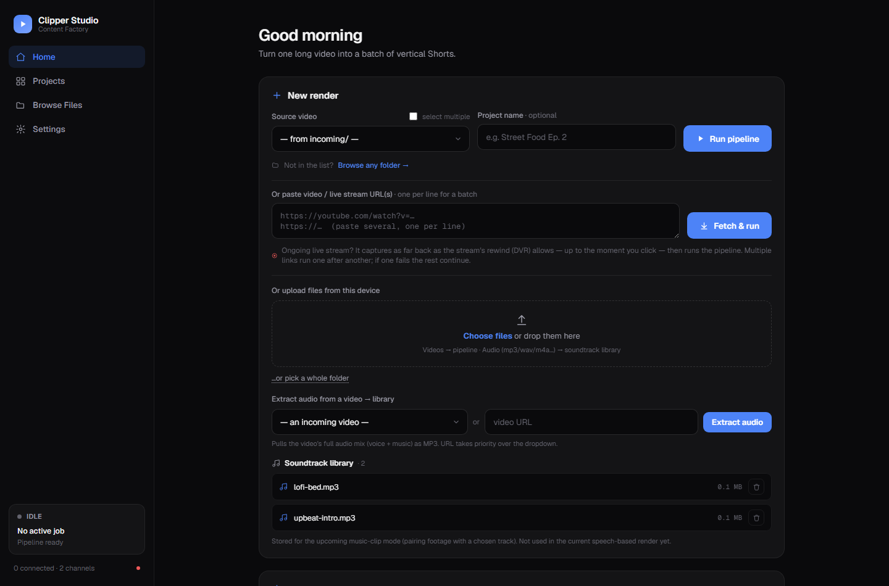

> The screenshots in this README were taken against a small synthetic demo dataset, so the
> project names and clips you see are placeholders, not real output.

---

## Contents

- [What it does](#what-it-does)
- [Requirements](#requirements)
- [Install](#install)
- [First run](#first-run)
- [Run with Docker](#run-with-docker)
- [Feature tour](#feature-tour)
- [Command line](#command-line)
- [Connecting a YouTube channel](#connecting-a-youtube-channel)
- [Configuration](#configuration)
- [Project layout](#project-layout)
- [Security notes](#security-notes)
- [Honest limitations](#honest-limitations)
- [Support the project](#support-the-project)
- [License](#license)

---

## What it does

The pipeline is a chain of small agents. A manager runs them in order, one project at a time,
with retries and per-project logging. Agents never call each other.

```
Video ─▶ Transcript ─▶ Analyzer ─▶ Editor ─▶ Subtitle ─▶ SEO ─▶ Thumbnail ─▶ QC ─▶ Compliance ─▶ Upload
        faster-whisper    LLM     ffmpeg+     karaoke    titles,    frame +    checks   word +      YouTube
                                  OpenCV        ASS      hashtags    title              LLM scan    Data API
```

| Agent | What it actually does |
|---|---|
| **Transcript** | faster-whisper, word-level timestamps, auto language detection |
| **Analyzer** | Sends the transcript to Ollama in chunks and gets back scored highlight ranges with a reason for each |
| **Editor** | Cuts each range, detects faces (YuNet), works out who is speaking, crops to 9:16 following that person, optional loudness normalisation / silence trimming / punch-in |
| **Subtitle** | Word-by-word karaoke ASS subtitles burned into the render |
| **SEO** | Title, description, hashtags and keywords per clip, in the language you choose |
| **Thumbnail** | Picks a frame and stamps the title on it |
| **QC** | Sanity-checks duration, resolution and that the file is playable |
| **Compliance** | Word list + LLM pass that flags clips as PASS / REVIEW / FAIL |
| **Upload** | Uploads passing clips to YouTube with the generated metadata, private by default |

Every stage writes its output into the project folder, so you can inspect, fix or re-run
any part of it by hand.

---

## Requirements

| | |
|---|---|
| **Python** | 3.10 or newer |
| **ffmpeg + ffprobe** | Must be on your `PATH` |
| **Ollama** | Running locally, with a model pulled |
| **GPU** | Optional. NVIDIA + CUDA makes transcription several times faster; CPU works but is slow on long videos |
| **Disk** | Renders are large. A 1-hour source easily produces several GB across `projects/` |

Install ffmpeg:

```bash
sudo apt install ffmpeg
```

On Windows, download a build from [ffmpeg.org](https://ffmpeg.org/download.html) and add its
`bin` folder to `PATH`. On macOS, `brew install ffmpeg`.

Pull a model for Ollama — a 7B model is the safe default for 8–16 GB of VRAM:

```bash
ollama pull qwen2.5:7b
```

---

## Install

```bash
git clone https://github.com/dhimasbagus402/clipper-bot.git
```

```bash
cd clipper-bot && python -m venv .venv
```

Activate the virtualenv (`source .venv/bin/activate`, or `.venv\Scripts\activate` on Windows), then:

```bash
pip install -r requirements.txt -r requirements-dashboard.txt
```

`requirements-upload.txt` is only needed if you want YouTube uploading:

```bash
pip install -r requirements-upload.txt
```

Create your config and environment files from the templates:

```bash
cp config.example.yaml config.yaml && cp .env.example .env
```

On Windows use `copy` instead of `cp`. Neither file is tracked by git — `config.yaml` can end
up holding campaign briefs, and `.env` holds your dashboard password.

---

## First run

```bash
python dashboard.py
```

Open <http://127.0.0.1:5000>. That is the whole setup — the dashboard creates `projects/`
on its own and finds anything you drop into `incoming/`.

To pick a different port or expose it on your network:

```bash
HOST=0.0.0.0 PORT=8080 python dashboard.py
```

**If you bind to anything other than `127.0.0.1`, set `DASH_PASSWORD` in `.env` first.**
The dashboard can start renders, browse your filesystem and upload to your YouTube account.

---

## Run with Docker

```bash
docker compose up -d --build
```

`docker-compose.yml` mounts the project directory into the container, so `config.yaml`,
`projects/`, `incoming/` and your channel tokens all stay on the host. Ollama is expected to
run on the **host**, not in the container — the compose file already points the container at
`host.docker.internal:11434`.

`DASH_PASSWORD` is required by the compose file; put it in `.env` before starting.

To expose the dashboard publicly through a Cloudflare quick tunnel (no account needed):

```bash
docker compose --profile public up -d
```

The generated URL is printed in `docker compose logs tunnel`.

---

## Feature tour

### Get video in, five different ways

The Home page is the ingest point. Pick a file from `incoming/`, paste one or more video or
livestream URLs (handled by yt-dlp — a running stream is captured as far back as its DVR
buffer allows), upload files or a whole folder from your browser, point at a Google Drive
folder, or just browse to a path on disk. Several videos can be merged into one project or
run as separate projects.

Audio can also be extracted from any video or URL into a soundtrack library for later use.


### Tell the bot what you want

Instead of hunting through settings, describe the change. The assistant is backed by the same
local Ollama model and can change configuration, apply a campaign brief, attach a watermark or
kick off a render — *"clips 10–30s, zoom out a bit, then run tes1.mp4"*.

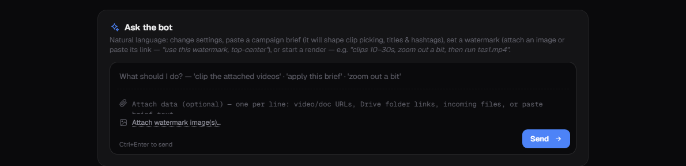

### Watch the run

Stage-by-stage progress with a live log tail, plus pause and stop that take effect at the next
safe checkpoint rather than corrupting a half-written render.

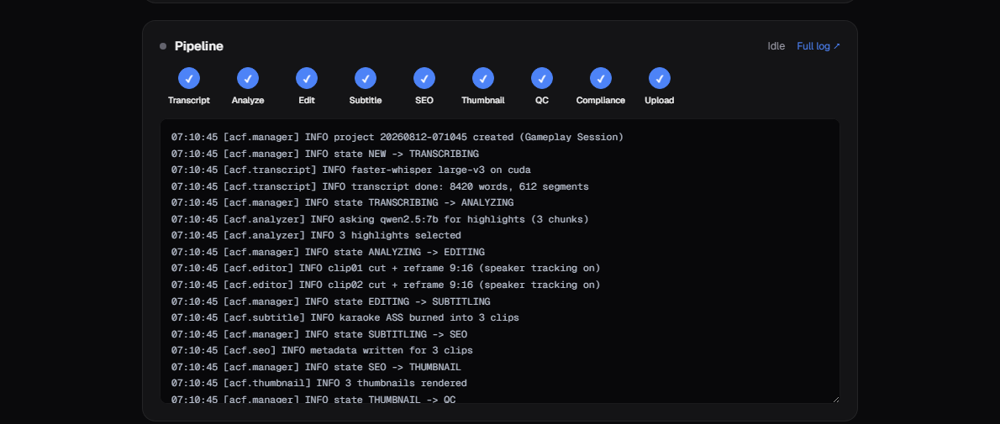

### Keep track of output

Totals across every project, and the most recent renders with their clip counts and how many
are already live.

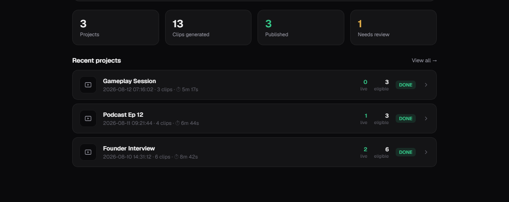

### Projects

Every render, searchable, pinned first. Rename, pin, open the log, bulk-upload or bulk-delete.

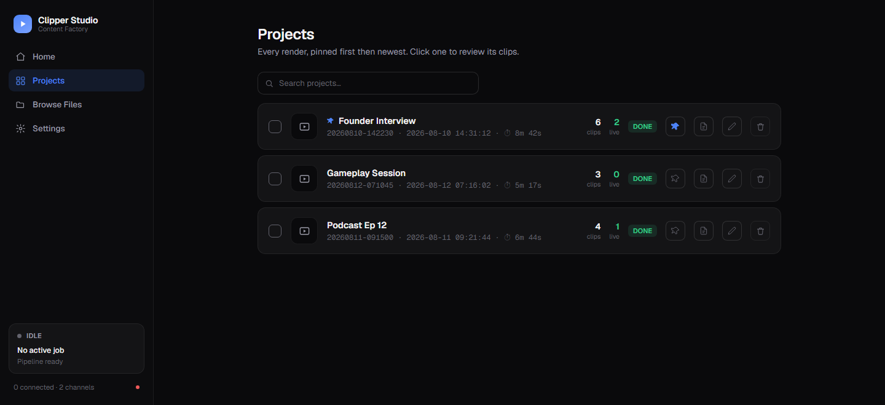

### Review clips before they go out

Each clip shows its thumbnail, the highlight score the LLM gave it, the generated title,
duration, QC and compliance status, and whether it has already been published. Select any
combination and upload or delete them together. Titles and descriptions stay editable.

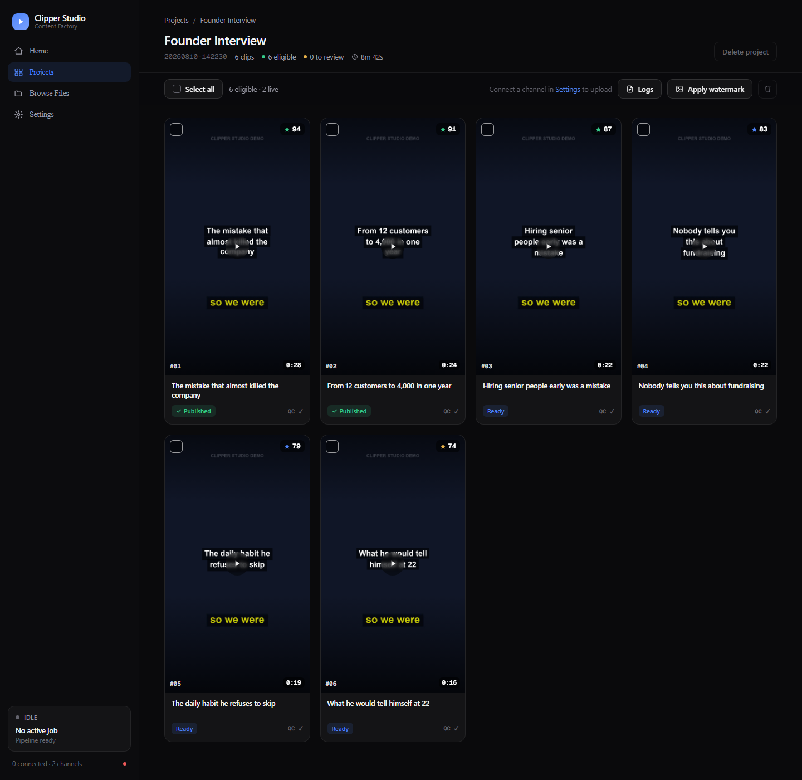

### Browse the whole disk

Find footage anywhere on the machine and send a file — or an entire folder — into the pipeline
without copying it first.

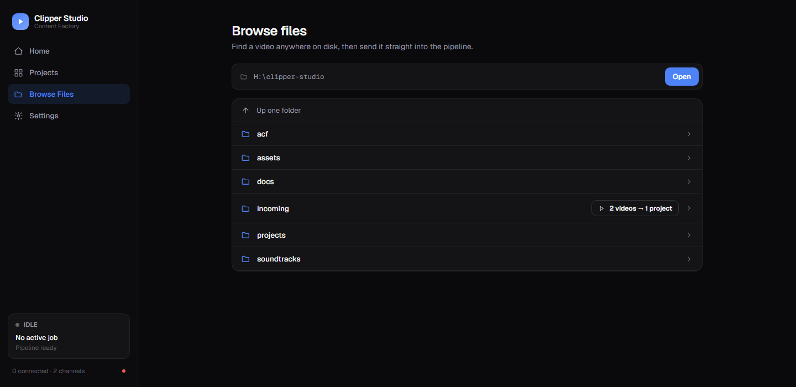

### Multiple channels

Each channel is a separate YouTube account with its own OAuth token. Connecting one opens a
normal Google login in your browser; the callback lands back on the dashboard itself.

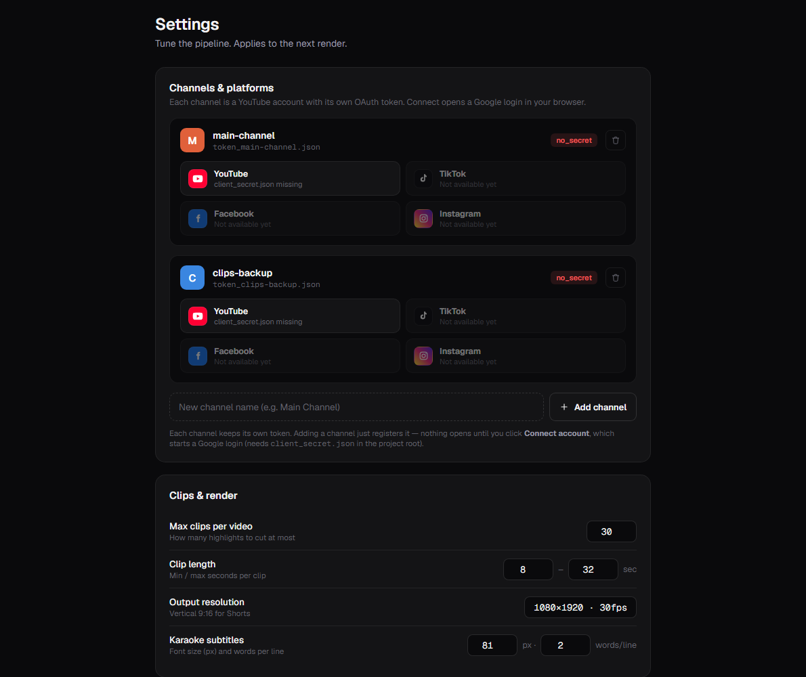

### Place a watermark by dragging it

Upload a logo or add a text handle, then drag it onto a real frame from your latest render.
The yellow zone shows where subtitles will sit so you do not cover them. Watermarks can also
be applied to an already-rendered project.

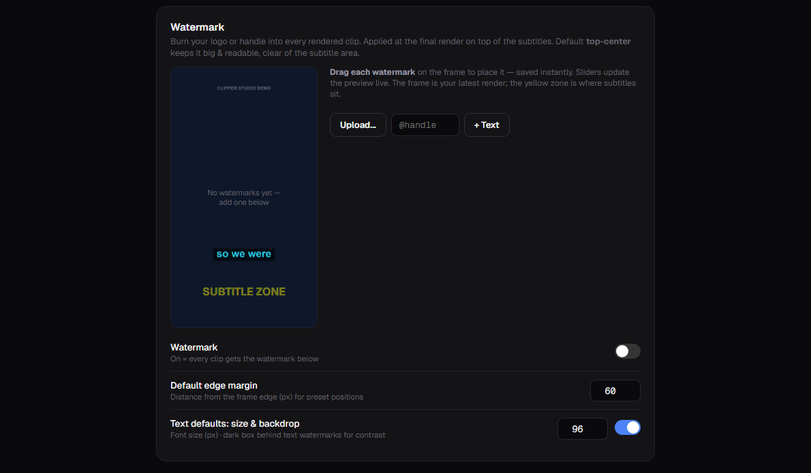

### Tune the framing

How tightly the 9:16 crop holds a face, whether it follows the active speaker, what happens
when several people talk at once, plus loudness normalisation, silence trimming and punch-in.

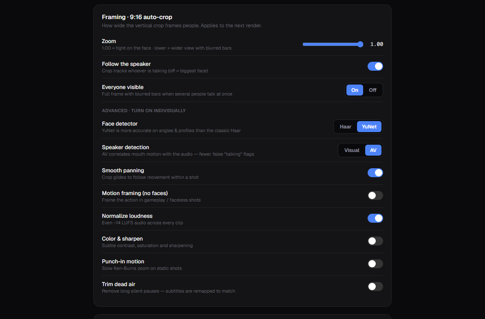

### Models and campaign brief

Point the pipeline at any Ollama model and any Whisper size. The campaign brief is persistent
context the Analyzer and SEO agents follow — paste a client's requirements once and every clip
respects them.

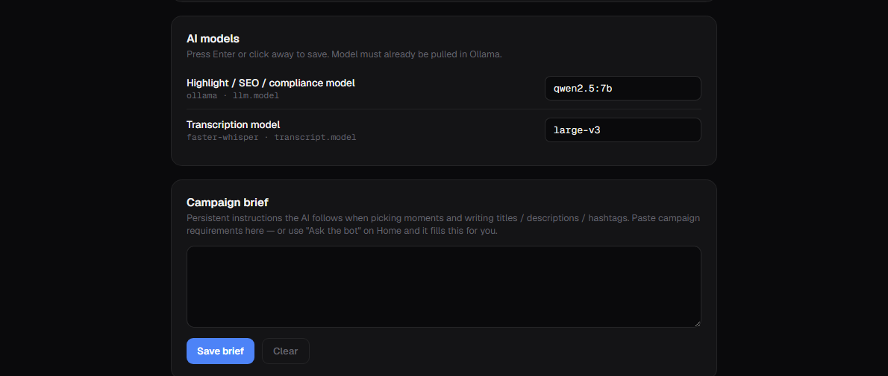

### Rewrite the agent prompts

The exact prompts for the Analyzer, SEO and Compliance agents are editable, with placeholder
validation so you cannot save something that will break at render time. A raw `config.yaml`
editor is there for everything else.

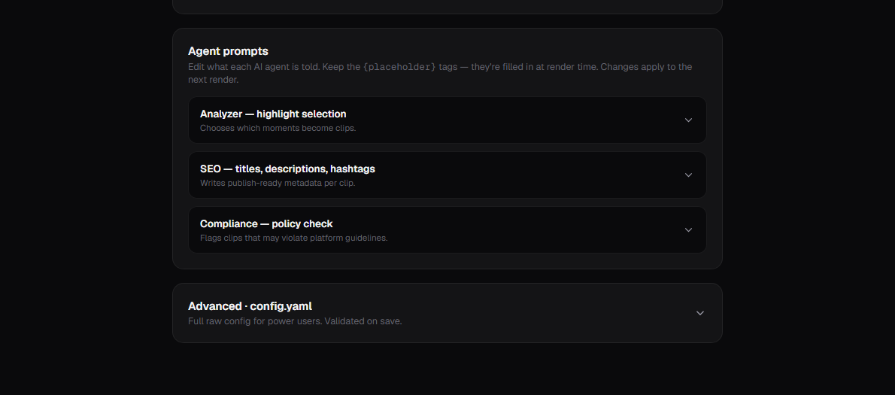

---

## Command line

The dashboard is optional. The pipeline runs headless:

```bash
python run.py incoming/podcast.mp4 --name "Podcast Ep 12"
```

Results land in `projects/<ProjectID>/render/clip01.mp4`, `clip02.mp4`, … alongside
`metadata/report.json`.

To compare how different Ollama models pick highlights on a transcript you already have — no
re-transcription:

```bash
python compare_models.py --models qwen2.5:7b qwen2.5:14b
```

---

## Connecting a YouTube channel

Uploading is **off by default**. To turn it on:

1. Create a project at [console.cloud.google.com](https://console.cloud.google.com).
2. Under *APIs & Services*, enable **YouTube Data API v3**.
3. On the *OAuth consent screen*, choose External and add your own account as a test user.
4. Under *Credentials*, create an **OAuth client ID** of type *Desktop app*.
5. Download the JSON, rename it to `client_secret.json`, and put it in the project root.
6. `pip install -r requirements-upload.txt`
7. In the dashboard: *Settings → Channels & platforms → Add channel → Connect account*.
8. Set `upload.enabled: true` in `config.yaml` (leave `privacy: private` until you trust the output).

Each channel gets its own `token_<name>.json`. All of these files are git-ignored.

**Quota:** one upload costs roughly 1,600 units of the default 10,000/day, so about **6 uploads
per day** unless you request more from Google.

---

## Configuration

Everything lives in `config.yaml`, and every field is documented in
[`config.example.yaml`](config.example.yaml). The dashboard edits the same file, so you can
switch between the UI and a text editor freely.

A few environment variables override or supplement it:

| Variable | Purpose |
|---|---|
| `DASH_USERNAME` / `DASH_PASSWORD` | Dashboard login. Empty password = no login (localhost only). |
| `HOST` / `PORT` | Where the dashboard binds. Defaults to `127.0.0.1:5000`. |
| `ACF_LLM_HOST` | Override the Ollama URL — used by Docker to reach the host. |
| `OAUTH_REDIRECT_URL` | Google OAuth callback. Change it if you move the port. |
| `DASH_MAX_UPLOAD_MB` | Total size cap per browser upload request. |
| `HF_TOKEN` | Optional. Faster Whisper model downloads. |

---

## Project layout

```
acf/
  manager.py        pipeline orchestration + state machine
  states.py         NEW → TRANSCRIBING → … → DONE / FAILED
  db.py             SQLite: projects and clips
  control.py        cooperative pause / stop across threads
  prompts.py        default prompts + user overrides
  agents/           one file per pipeline stage
  models/           bundled YuNet face detection model
dashboard.py        the whole web UI (Flask, single file)
run.py              headless CLI entry point
compare_models.py   side-by-side highlight comparison across LLMs
incoming/           drop source videos here
projects/           generated output, one folder per run
```

Each project folder holds `input/`, `audio/`, `transcript/`, `clips/`, `work/`, `render/`,
`subtitle/`, `thumbnail/`, `metadata/` and `logs/`, so every intermediate artifact is on disk
and inspectable.

---

## Security notes

- The dashboard has **no login by default**. That is fine on `127.0.0.1` and dangerous anywhere
  else — it can browse your filesystem, start renders and upload to your account. Set
  `DASH_PASSWORD` before exposing it, including through the Cloudflare tunnel profile.
- `.env`, `client_secret.json`, `token*.json`, `channels.json` and `config.yaml` are all in
  `.gitignore`. Keep them there.
- If you ever committed one of those files by accident, rotate the credential — deleting the
  file from a later commit does not remove it from git history.

---

## Honest limitations

- **Copyright is not checked.** The Compliance agent scans language, nothing else. It has no
  idea whether your music or footage is licensed. YouTube's Content ID still applies.
- **Highlight scores are relative, not predictive.** The LLM ranks moments within one video.
  A 94 does not mean the clip will do well; it means the model liked it more than the 79.
- **Reframing is good, not perfect.** Speaker tracking works well for talking-head content.
  Fast-moving subjects and crowded frames still produce awkward crops.
- **One job at a time.** The manager deliberately runs sequentially so Whisper and the LLM
  never fight over VRAM.
- **Only YouTube uploads.** The TikTok / Instagram / Facebook tiles in the UI are placeholders
  for planned work, not working integrations.

---

## Support the project

Clipper Studio is free and open source. If it saves you time, you can buy me a coffee:

[](https://trakteer.id/dhimas_bagus4/tip)
[](https://sociabuzz.com/dhimasbagus402/tribe)
[](https://ko-fi.com/dhimasbagus)

- Trakteer — <https://trakteer.id/dhimas_bagus4/tip>
- SociaBuzz — <https://sociabuzz.com/dhimasbagus402/tribe>
- Ko-fi — <https://ko-fi.com/dhimasbagus>

---

## License

[MIT](LICENSE).

The bundled face detection model (`acf/models/face_detection_yunet_2023mar.onnx`) is YuNet,
from [OpenCV Zoo](https://github.com/opencv/opencv_zoo), and carries its own license.
